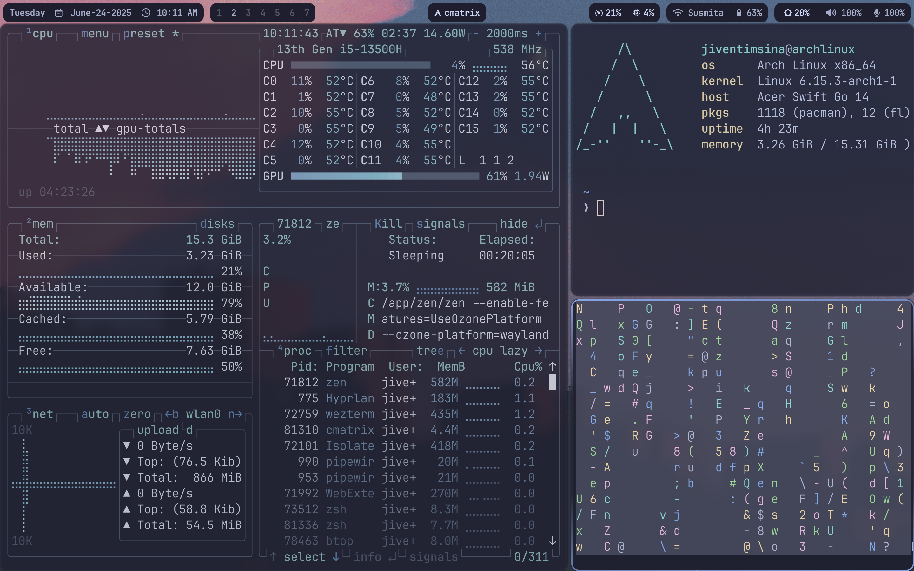

# Dotfiles

## Included Configurations
- **Window Manager:**`hyprland + waybar + greetd-tui`
- **Terminal:**`wezterm`
- **Shell:**`zsh`
- **Editor:**`nvim, vim`
## 

## Use this config
```bash
git clone --recurse-submodules https://github.com/JivenTimsina/dotfiles ~/.dotfiles
cd .dotfiles
chmod +x setup.sh
./setup.sh
